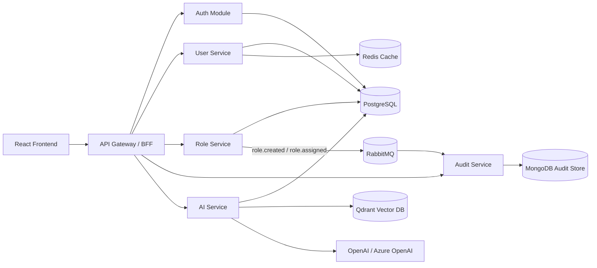

# Arquitectura objetivo (Microservicios + IA)

## Diagrama (Mermaid)

## Microservicios

- `API Gateway` (servidor principal): autenticación, sesión, autorización y agregación/proxy de APIs.
- `user-service`: consulta de usuarios, con caché Redis para lecturas frecuentes.
- `role-service`: administración de roles y asignación de roles, publica eventos de auditoría.
- `audit-service`: consume eventos RabbitMQ y persiste trazas en MongoDB; expone consulta de auditoría.
- `ai-service`: chat, generación de imagen, RAG (embeddings + recuperación en Qdrant + respuesta LLM).

## Estrategia multi-DB

- **PostgreSQL**: datos transaccionales (`users`, `roles`, `user_roles`, `conversations`, `messages`, `sessions`).
- **MongoDB**: auditoría orientada a eventos (`audit_logs`) para escritura flexible y consulta de historial.
- **Redis**: caché de lecturas en `user-service` para disminuir latencia y carga en Postgres.
- **Qdrant**: almacenamiento vectorial para RAG (documentos indexados + búsqueda semántica).

## Comunicación síncrona y asíncrona

- **Síncrona (REST)**: frontend → gateway, gateway → microservicios.
- **Asíncrona (RabbitMQ)**: `role-service` publica eventos de negocio; `audit-service` consume y persiste.

## DDD + Clean Architecture (aplicación práctica)

- **Bounded contexts**: Identity/Access (`auth`, `users`, `roles`), Audit, AI Assistant.
- **Separación por responsabilidad**: cada servicio concentra su caso de uso y dependencia de datos.
- **Puertos y adaptadores**: HTTP como adaptador de entrada; DB/MQ/LLM como adaptadores de salida.
- **Regla de dependencia**: la orquestación de casos de uso ocurre dentro de cada servicio, no en el frontend.

## Resiliencia y manejo de fallos

- Gateway responde `502` cuando un servicio interno está caído.
- `role-service` no bloquea operación por falla temporal de publicación de evento (log estructurado + retry implícito por reconnect).
- `audit-service` intenta reconectar automáticamente a RabbitMQ.
- `ai-service` responde `503` si falta configuración de OpenAI o vector DB.

## Docker Compose (estructura)

La orquestación local incluye:

- `app` (gateway)
- `user-service`, `role-service`, `audit-service`, `ai-service`
- `postgres`, `redis`, `mongodb`, `rabbitmq`, `qdrant`

Archivo: `docker-compose.yml`.
